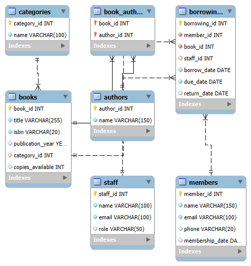

# 📚 Library Management System

## 📘 Project Title
Library Management System

## 📖 Description
This is a MySQL-based Library Management System designed to efficiently manage books, authors, categories, members, staff, and borrowing transactions. The schema is normalized and designed with scalability and maintainability in mind.

Key features include:
- Tracking of book details, authors, and categories
- Support for multiple authors per book (many-to-many)
- Member and staff management
- Borrowing and return records with due dates

## 🚀 How to Run / Setup the Project

1. **Install MySQL** on your system if not already installed.
2. **Open MySQL Workbench** (or another MySQL client).
3. **Run the SQL script**:
   - Open the provided `library.sql` file.
   - Execute the script to create the `librarydb` database and all necessary tables.

